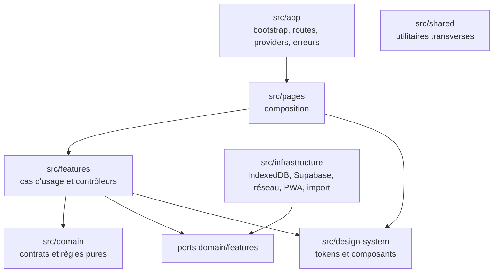
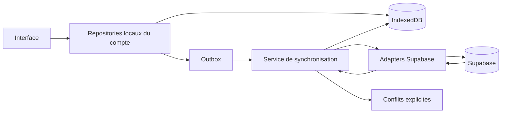
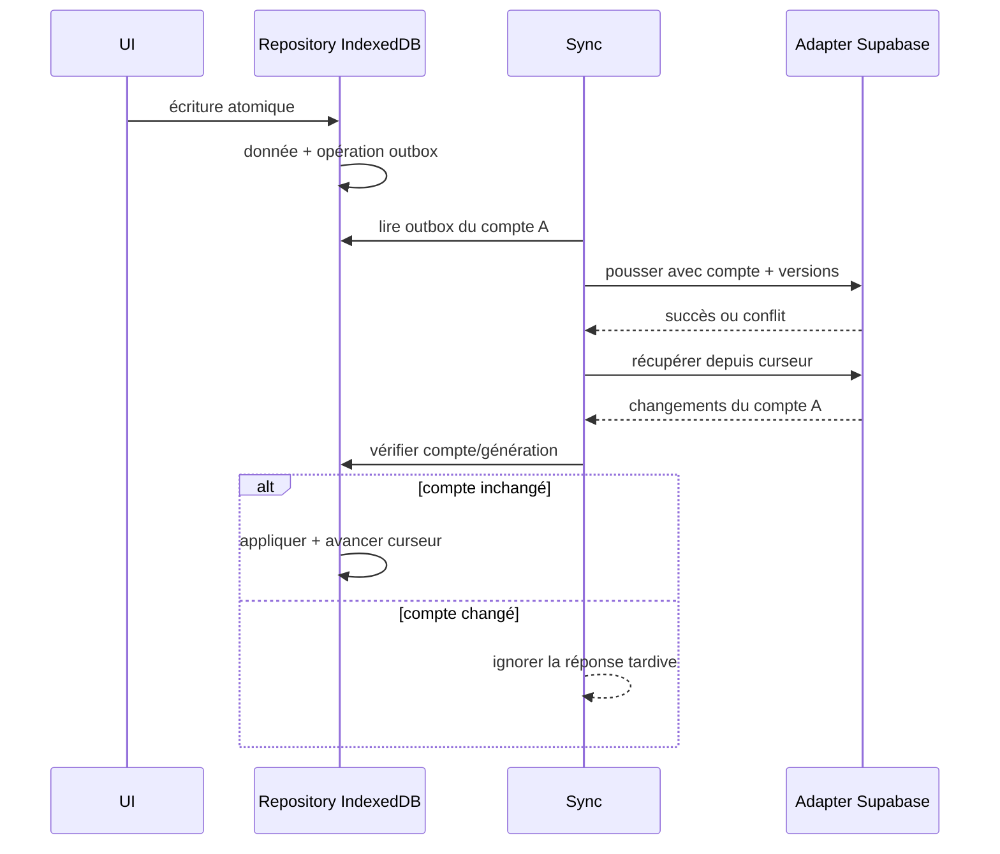
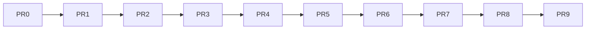

# Architecture technique

> **Objectif :** définir les frontières, dépendances et qualités d'exécution de Quiz TSI Next. **Document normatif.**

## Sommaire
1. [Stack](#stack) · 2. [Routes](#routes-et-déploiement) · 3. [Couches](#couches) · 4. [Local-first](#architecture-local-first) · 5. [Synchronisation](#synchronisation) · 6. [Supabase](#supabase-et-sécurité) · 7. [PWA](#pwa) · 8. [Accessibilité](#accessibilité) · 9. [Tests](#tests) · 10. [PR](#dépendance-des-pr)

## Stack

Vite, React, TypeScript strict, React Router, propriétés CSS globales, CSS Modules par composant, Supabase, IndexedDB, Vitest, React Testing Library, Playwright, PWA, GitHub Actions et GitHub Pages pour les premiers environnements de prévisualisation. Aucun numéro de version en PR0 : PR1 les verrouille après vérification de compatibilité.

Interdits : Tailwind, Bootstrap, Material UI, Chakra UI, Ant Design, bibliothèque de dashboard ou framework CSS généraliste ; Redux sans ADR ; dépendance de dessin remplaçant le moteur vectoriel sans décision validée.

## Routes et déploiement

React Router utilise un basename calculé depuis `import.meta.env.BASE_URL`. `/`, `/login`, `/whiteboard`, `/progress`, `/questions`, `/settings`, `/account` et `/admin` suivent la spécification produit. Navigation directe, rechargement, PWA, offline et base GitHub Pages doivent fonctionner. Une stratégie de fallback GitHub Pages et PWA sera implémentée et testée dans les PR techniques ; **pas de `HashRouter`**, sauf décision documentaire ultérieure.

## Couches

- `src/app` : démarrage, routage, providers, erreurs globales.
- `src/pages` : composition, aucune logique métier profonde.
- `src/features` : cas d'usage, UI fonctionnelle, contrôleurs.
- `src/domain` : types, règles, services purs ; aucune dépendance React, DOM, Supabase ou IndexedDB.
- `src/infrastructure` : adapters IndexedDB/Supabase/réseau/PWA/import historique.
- `src/design-system` : tokens, génériques, styles communs ; aucune feature.
- `src/shared` : seulement du réellement transversal, jamais fourre-tout.

Pages importent features/design-system. Features importent domain, design-system et l'infrastructure uniquement au travers d'interfaces injectées. Infrastructure implémente les ports de domain/features. Aucun composant UI ne requête Supabase, ne manipule `localStorage`, ni ne connaît l'outbox.

## Architecture local-first

1. IndexedDB est la source persistante locale ; l'UI lit ses repositories.
2. Toute modification est persistée immédiatement et son opération distante mise en outbox.
3. Synchronisation : pousser, puis récupérer ; conflits explicites.
4. Une réponse tardive n'est appliquée qu'au compte/génération qui l'a demandée.
5. Changer de compte annule les travaux, ferme repositories/DB du précédent, nettoie l'état mémoire puis ouvre l'espace isolé.

Aucune clé `localStorage` globale pour progression, questions privées, filtres, parcours, préférences Pencil, brouillons ou compte. Seules de petites données techniques, non sensibles, non liées à un compte et justifiées peuvent l'utiliser.

## Synchronisation

Opérations idempotentes, reprises après coupure, backoff borné et état compréhensible. Les conflits ne sont jamais écrasés silencieusement.

## Supabase et sécurité

Supabase reste derrière des adapters pour Auth, profils/rôles, progression append-only, banque, administration et synchronisation. RLS obligatoire ; jamais de service-role key dans le navigateur ; aucune administration Auth directe côté client ; opérations sensibles dans des fonctions serveur ; validation client **et** serveur ; développement séparé de production. Les permissions serveur font autorité. Aucune migration en PR0.

Menaces traitées : contenu segmenté et math rendu de façon contrôlée, aucun HTML distant arbitraire, `eval` ou `new Function` ; secrets absents ; cache partagé interdit ; compte et versions vérifiés.

## PWA

Installation, manifest, assets et KaTeX locaux, aucune police distante, shell précaché, stratégies séparées assets/données, mise à jour contrôlée, écran hors connexion, reprise d'outbox, migrations IndexedDB et base GitHub Pages configurable. Les réponses Supabase privées ne sont **jamais** mises en cache par le service worker. La stratégie exacte appartient aux PR techniques.

## Accessibilité

Cible WCAG AA : focus visible, clavier, Échap, restauration du focus, `aria-current`, `aria-expanded`, `aria-live`, `inert`, labels visibles, erreurs textuelles, aucune information par seule couleur/hover, cibles 44×44 px, `prefers-reduced-motion`, safe areas, ordre DOM logique et lecteurs d'écran. Le zoom système n'est pas bloqué hors mode d'écriture.

## Tests

`tests/unit` règles pures ; `tests/integration` repositories/adapters ; `tests/browser` parcours, PWA, Pencil et accessibilité ; `tests/visual` portrait/paysage et régressions ciblées. Les tests réseau utilisent des frontières contrôlées et vérifient isolation et retards. Les performances du Canvas sont mesurées sur iPad cible, sans coupler la scène à React.

## Dépendance des PR

Cette chaîne exprime une barrière de fusion : aucune PR dépendante ne commence avant fusion de sa dépendance dans `main`.
