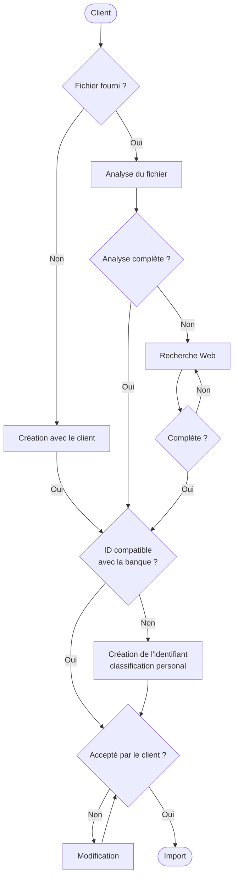

# Discussion type — GPT « Import Quiz TSI »

Sert de référence pour vérifier que le GPT applique correctement `GPT_INSTRUCTIONS.md`. À coller dans les « Amorces de conversation » ou à garder comme test de non-régression manuel après toute modification des instructions ou du Knowledge.

## Schéma du déroulé attendu



Correspondance avec les règles de `GPT_INSTRUCTIONS.md` :

- **ID compatible avec la banque ?** = l'étape 4 (`chapterId`/`notionId` trouvés sur la même ligne du Knowledge). Un « Non » ne doit jamais mener à inventer un identifiant officiel — toujours basculer en classification `personal`.
- **Accepté par le client ? → Non → Modification → Accepté par le client ?** = boucle de l'étape 5. Chaque passage par « Modification » doit réafficher l'aperçu complet avant de redemander confirmation.
- **Import** ne doit être atteint qu'une seule fois par contenu validé ; un nouveau passage par cette case après une correction utilise un nouvel `importId`.

Cas couvert : une fiche « Primitives » dont la première partie (10.4) porte en réalité sur la dérivation d'une fonction composée — donc un autre chapitre que le reste du document — et dont les autres questions sont des calculs fixes, sans variable aléatoire.

## 1. Utilisateur envoie la photo

> Analyse cette photo de mon cours.

Le GPT lit l'énoncé, résout chaque calcul en s'appuyant sur `program-knowledge.json`, et affiche un aperçu avant tout appel d'action.

## 2. Aperçu affiché par le GPT (correct)

```
Couverture : text-and-visuals

10.4 — Dérivée d'une fonction composée (II)
  Classification officielle :
    chapterId: derivatives-function-study   (chapitre "Dérivation et étude de fonctions")
    notionId:  DER-F04                      (même ligne du Knowledge que chapterId ci-dessus)
  parameterization: null (calcul fixe sur une expression donnée, pas de plage aléatoire)

10.5 / 10.6 / 10.7 — Trigonométrie, primitives usuelles, trigonométrie réciproque
  Classification officielle :
    chapterId: primitives-integrals         (chapitre "Primitives et intégrales")
    notionId:  INT-F01 ou INT-F02 selon l'exercice
  parameterization: null (idem : expression précise, aucune variable à randomiser)
```

Point clé à vérifier : `chapterId` change entre 10.4 (`derivatives-function-study`) et 10.5–10.7 (`primitives-integrals`), même si les deux groupes viennent du même document/de la même fiche « Primitives ». Le `chapterId` suit toujours le `notionId`, jamais le titre du document.

## 3. Confirmation utilisateur

> je valide

## 4. Appel de l'action

Le GPT appelle `importQuestionDrafts` avec `confirmedByUser: true`, un `importId` stable, et pour chaque question :

- `classification.chapterId` / `classification.notionId` recopiés exactement depuis la ligne correspondante du Knowledge (jamais réutilisés d'une question à l'autre sans revérifier),
- `parameterization: null`.

## 5. Réponse attendue du serveur

```json
{ "accepted": [0, 1, 2, ...], "quarantined": [], "warnings": [], "replayed": false }
```

## 6. Si un retry est nécessaire

Si un import échoue et que le contenu envoyé change (correction d'une classification, d'une formule, etc.), le GPT doit utiliser un **nouvel `importId`**. Rejouer le même `importId` avec un payload identique renvoie le rapport déjà en cache (`replayed: true`) sans réévaluer quoi que ce soit côté serveur — ce n'est jamais un moyen de corriger une quarantaine.

## Erreurs à ne pas reproduire (observées en production)

| Symptôme serveur                                                                  | Cause                                                                                                                             | Règle à appliquer                                                                   |
| --------------------------------------------------------------------------------- | --------------------------------------------------------------------------------------------------------------------------------- | ----------------------------------------------------------------------------------- |
| `classification-unresolved` sur un `notionId` pourtant valide                     | `chapterId` du document réutilisé pour toutes les questions au lieu du `chapterId` propre à chaque `notionId`                     | `chapterId` et `notionId` viennent toujours de la même ligne du Knowledge           |
| `invalid-parameterization` sur un calcul fixe                                     | `parameterization` renseigné avec des `variables` pour une variable muette (`t`, `x`) qui n'est pas une variable de randomisation | `parameterization: null` sauf plage numérique aléatoire explicite                   |
| Retry avec le même `importId` toujours en échec                                   | Le rapport en cache (`replayed`) est renvoyé sans réévaluation                                                                    | Utiliser un nouvel `importId` à chaque nouvelle tentative avec un payload corrigé   |
| `invalid-classification` sur une classification `personal` proposée sans chapitre | `proposedChapterTitle` omis du JSON au lieu d'être envoyé à `null`                                                                | Toujours envoyer les cinq clés de `personal`, `null` explicite quand non applicable |
