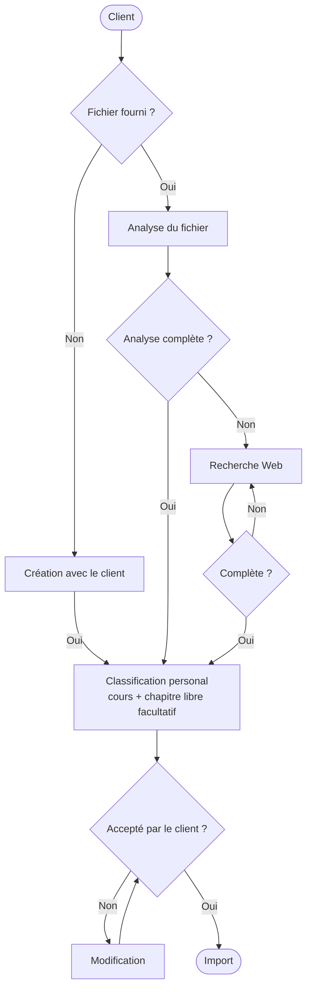

# Discussion type — GPT « Import Quiz TSI »

Sert de référence pour vérifier que le GPT applique correctement `GPT_INSTRUCTIONS.md`. À coller dans les « Amorces de conversation » ou à garder comme test de non-régression manuel après toute modification des instructions.

## Schéma du déroulé attendu



Correspondance avec les règles de `GPT_INSTRUCTIONS.md` :

- **Classification personal** = l'étape 4. Toute question reçoit un cours obligatoire et un chapitre libre facultatif (simple tag texte) — il n'y a jamais de rattachement au programme officiel TSI dans ce flux.
- **Accepté par le client ? → Non → Modification → Accepté par le client ?** = boucle de l'étape 5. Chaque passage par « Modification » doit réafficher l'aperçu complet avant de redemander confirmation.
- **Import** ne doit être atteint qu'une seule fois par contenu validé ; un nouveau passage par cette case après une correction utilise un nouvel `importId`.

Cas couvert : une fiche « Formulaire » à plusieurs pages, avec des questions issues de plusieurs domaines mathématiques différents, dont une comporte un calcul fixe sans variable aléatoire.

## 1. Utilisateur envoie la photo

> Analyse cette photo de mon formulaire.

Le GPT lit l'énoncé, résout chaque calcul, et affiche un aperçu avant tout appel d'action.

## 2. Aperçu affiché par le GPT (correct)

```
Couverture : text-and-visuals

10.4 — Dérivée d'une fonction composée (II)
  Classification personal :
    proposedCourseTitle: Formulaire
    proposedChapterTitle: Dérivation
    reason: Rappel de dérivation en tête de fiche, avant les primitives.
  parameterization: null (calcul fixe sur une expression donnée, pas de plage aléatoire)

10.5 / 10.6 / 10.7 — Trigonométrie, primitives usuelles, trigonométrie réciproque
  Classification personal :
    proposedCourseTitle: Formulaire
    proposedChapterTitle: Primitives
    reason: Trois formules de primitives usuelles regroupées sur la même page.
  parameterization: null (idem : expression précise, aucune variable à randomiser)
```

Point clé à vérifier : `reason` est spécifique à chaque groupe de questions, pas un texte générique recopié ; `proposedCourseTitle` reste le même cours tant que le client n'a pas demandé de le scinder.

## 3. Confirmation utilisateur

> je valide

## 4. Appel de l'action

Le GPT appelle `importQuestionDrafts` avec `confirmedByUser: true`, un `importId` stable, et pour chaque question, les cinq clés de `classification` (`kind`, `proposedCourseTitle`, `proposedChapterTitle`, `reason`, `requiresUserConfirmation`), `proposedChapterTitle` explicitement à `null` quand il n'y en a pas.

## 5. Réponse attendue du serveur

```json
{ "accepted": [0, 1, 2, ...], "quarantined": [], "warnings": [], "replayed": false }
```

## 6. Si un retry est nécessaire

Si un import échoue et que le contenu envoyé change (correction d'une classification, d'une formule, etc.), le GPT doit utiliser un **nouvel `importId`**. Rejouer le même `importId` avec un payload identique renvoie le rapport déjà en cache (`replayed: true`) sans réévaluer quoi que ce soit côté serveur — ce n'est jamais un moyen de corriger une quarantaine.

## Erreurs à ne pas reproduire (observées en production)

| Symptôme serveur                                                                                                                                                             | Cause                                                                                                                                                               | Règle à appliquer                                                                                                                                                |
| ---------------------------------------------------------------------------------------------------------------------------------------------------------------------------- | ------------------------------------------------------------------------------------------------------------------------------------------------------------------- | ---------------------------------------------------------------------------------------------------------------------------------------------------------------- |
| Retry avec le même `importId` toujours en échec                                                                                                                              | Le rapport en cache (`replayed`) est renvoyé sans réévaluation                                                                                                      | Utiliser un nouvel `importId` à chaque nouvelle tentative avec un payload corrigé                                                                                |
| `invalid-classification` sur une classification `personal` proposée sans chapitre                                                                                            | `proposedChapterTitle` omis du JSON au lieu d'être envoyé à `null`                                                                                                  | Toujours envoyer les cinq clés de `personal`, `null` explicite quand non applicable                                                                              |
| `invalid-classification : kind doit être "personal"`                                                                                                                         | Le GPT a essayé d'envoyer `kind: "official"` — ce chemin n'existe plus côté serveur                                                                                 | `kind` est toujours `"personal"`, plus jamais `"official"`                                                                                                       |
| `invalid-classification : clé inconnue pour une classification personnelle`                                                                                                  | `proposedNotionTitle` (ou tout autre champ) envoyé en plus des cinq clés attendues                                                                                  | N'envoyer que `kind`, `proposedCourseTitle`, `proposedChapterTitle`, `reason`, `requiresUserConfirmation`                                                        |
| Import « Schéma de l'Action » du GPT builder en échec : _circular dependency_                                                                                                | Le schéma exposé au GPT contenait `ParameterizedQuestionSpec`/`SafeExpression`, un composant auto-référencé que l'éditeur de schéma de ChatGPT ne sait pas résoudre | `parameterization` est un simple `{ type: 'null' }` dans le schéma de l'Action — plus de composant récursif à exposer                                            |
| Import « Schéma de l'Action » en échec : _server not under the root origin_                                                                                                  | Le YAML collé conservait le littéral `PROJECT_REF` au lieu du vrai identifiant du projet Supabase                                                                   | Remplacer `PROJECT_REF` par l'identifiant réel avant de coller le schéma dans le builder                                                                         |
| `invalid-document` pour une question construite par échange direct (sans photo/PDF)                                                                                          | `document.kind` envoyé comme `"direct-entry"` (ou `pageCount: 0`) alors que le schéma n'acceptait que `photo`/`pdf` avec `pageCount` positif                        | Pour une question sans fichier source, envoyer `document: { kind: "direct-entry", title: <titre bref>, pageCount: null }`                                        |
| `invalid-type` (ex. `type: "open-ended"`) ou question rejetée à cause de `difficulty: "easy"`                                                                                | Le GPT invente du vocabulaire générique de quiz au lieu des valeurs réelles du schéma                                                                               | `type` ∈ {`formula`, `course`, `calculation`, `reflex`} ; `difficulty` ∈ {`fundamental`, `standard`, `trap`}, toujours `null` pour `reflex`, jamais `null` sinon |
| Import « réussi » mais crée un nouveau Quizz au lieu de rejoindre celui déjà créé dans l'app                                                                                 | Le GPT invente `proposedCourseTitle` à partir du contexte au lieu de demander le nom exact du Quizz cible ; le serveur ne fait correspondre que par titre           | Toujours demander au client le nom exact du Quizz cible avant de construire la classification, puis le réutiliser tel quel                                       |
| Pas d'erreur serveur, mais énoncé illisible : une formule est écrite en toutes lettres (parfois mal transcrite, ex. `F2X`) dans un segment `text` au lieu d'un `inline-math` | Le serveur n'a aucun moyen de valider la _qualité_ du contenu d'un `text` — seul le GPT peut l'éviter                                                               | Aucune variable/expression dans un `text` ; toujours dans son propre `inline-math`/`display-math` en MathSource V1 ; relire chaque `text` avant l'appel          |
| `implicit-multiplication` (règle préventive, pas encore observée en production)                                                                                              | `2x` écrit sans `*` — MathSource V1 n'a jamais supporté la multiplication implicite dans la source, même si le rendu peut l'afficher sans astérisque                | Toujours écrire `2*x`, jamais `2x`                                                                                                                               |
